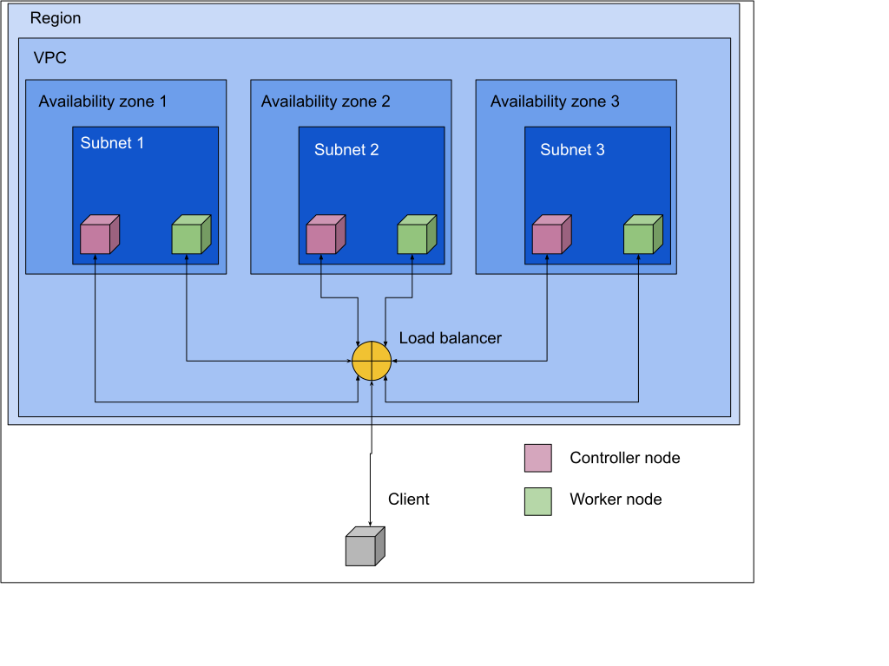

# DevOps/MLOps sandbox

This project is a small testing ground for some popular DevOps and MLOps frameworks. It bootstraps an ephemeral, highly available Kubernetes cluster from scratch on EC2 instances roughly following the [Kubernetes The Hard Way](https://github.com/kelseyhightower/kubernetes-the-hard-way) tutorial, but using Ansible and Terraform to streamline the whole process.

# Requirements

This project assumes a 64-bit Linux OS with the following dependencies already installed

1. Python, 3.8+ (versions 2.7 and 3.4+ are untested but should work too)
2. Terraform
3. Ansible
4. GNU make
5. AWS CLI, AWS credentials and permissions

## Bootstrapping a Kubernetes cluster

Parameters such as the number of controller nodes and worker nodes can be edited in the `tf/variables.tf` file. Nodes are allocated to subnets in a round-robin fashion.

1. Make sure the environment variables `AWS_ACCESS_KEY_ID` and `AWS_SECRET_ACCESS_KEY` are set and that the corresponding user has appropriate permissions. The policy in `tf/iam-policy/` can be used to this end.

2. From the root folder, run `make setup && export PATH=$(pwd)/bin:$PATH && make ca`. This will download precompiled binaries for `kubectl`, `cfssl` and `cfssljson` to the `bin` folder and add it to `PATH`. It will also bootstrap a certificate authority

3. If necessary, run `cd tf/ && terraform init` to initialise Terraform

4. From the root folder, run `make cluster`. This will take a while.

### Architecture

Nodes of the same type can communicate directly

### Execution

Terraform provisions the infrastructure according to files in the `tf` folder; python scripts in `py` use Terraform's formatted output to create configuration files at runtime using information of the instances' IP addresses. Specifically they create:

* The Ansible inventory
* certificate signing requests
* service unit files
* networking configuration
* entries in the routing table

Ansible is then used to place config files n each node and start the services.